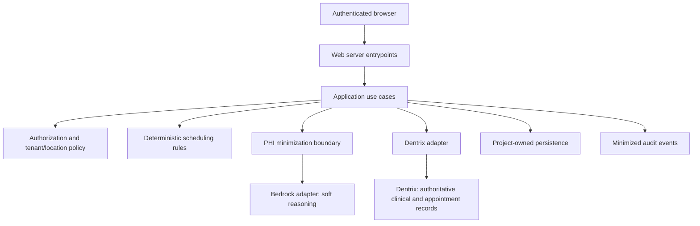

# Architecture overview

Status: **PROPOSED**. Milestone 0 repository preparation; no running application, API contract, database, AWS resource, or Dentrix connection exists. The [execution baseline](../project/execution-baseline.md) separates agreement requirements from engineering proposals and unknowns.

## Recommendation

Use a small npm-workspaces monorepo containing one modular application, six bounded internal packages, infrastructure definitions, and engineering documentation. Begin with one Next.js web/server deployment, subject to AWS runtime validation. Keep application use cases separate from transport and vendor adapters. A worker may later run the same application modules if verified webhook or recovery requirements need durable execution; that is not a commitment to independent services.

This gives one initial developer one dependency lock, one PR, and one release candidate for coordinated frontend/backend/domain changes. Future engineers can work within explicit boundaries. A flat application repository would be initially smaller but make dependency ownership less visible; separate repositories/services would add release and operational coordination before evidence justifies it. npm workspaces are sufficient at this stage; a task orchestrator can be added only when measured build complexity warrants it.

Next.js supports server and browser components and HTTP route handlers. Keep privileged dependencies server-side and make HTTP entrypoints thin; framework placement does not replace application authorization. See the official [server/client boundary](https://nextjs.org/docs/app/getting-started/server-and-client-components) and [backend-for-frontend guidance](https://nextjs.org/docs/app/guides/backend-for-frontend).

## Proposed runtime boundaries

Arrows describe intended calls, not trust grants or an implemented deployment. Adapters must preserve scope already authorized by the application, and every external input remains untrusted. AI returns bounded suggestions to application validation. It has no write route to Dentrix.

## Source dependency direction

| Module | Allowed direction once implemented | Exclusions |
| --- | --- | --- |
| Web browser modules | Explicitly browser-safe contracts | No application, security internals, data, or integrations |
| Web server entrypoints | Application and request/security validation | No domain rules embedded in routes |
| Server composition module | Application plus concrete integration/data adapters | Never imported by browser modules |
| Application | Scheduling, security policy, contracts; owns adapter ports | No framework or vendor SDK imports |
| Scheduling | Pure contracts if needed | No I/O, AI, database, application imports |
| Security policy | Pure contracts; owns mechanism interfaces where needed | No web framework dependency or concrete persistence import |
| Integrations | Application port types, approved security boundary helpers, contracts | No business-rule ownership or browser exports |
| Data | Application/security port types and contracts | No Dentrix clinical authority or UI imports |
| Contracts | Pure validation/type dependencies only | No upper-layer or external SDK dependencies |

These boundaries are documented now. Import/export enforcement, server-only guards, and dependency checks must be installed with the first authorized implementation; private package manifests alone do not enforce security. No package APIs or cyclic dependencies are introduced by this scaffold.

## Core design constraints

- Dentrix is authoritative for patients, treatments, providers, schedules, and final appointments. Project storage holds approved configuration, identity/membership records, rules and versions, audit evidence, and strictly bounded temporary recovery/mapping data.
- Hard constraints run deterministically on the server. AI may interpret soft preferences, suggest rankings, and explain results; all outputs remain untrusted and must pass validated structure and domain checks.
- Explicit **Approve and Submit** is required for each appointment write. User authorization, approved tenant/location, current availability, rule version, duplicate prevention, and environment write enablement are separate checks.
- A timeout after a write may have an unknown outcome. Read-back/reconciliation capability, concurrency control, and safe retry policy require evidence before the booking design is finalized.
- PHI is excluded from repository artifacts and minimized across runtime boundaries. Random patient tokens and encrypted mapping do not automatically make prompts, schedules, metadata, or outputs de-identified.
- Agreement §4.1 requires MFA, role separation, 15-minute idle sessions, prevention of concurrent sessions, one designated AWS region, TLS 1.2+, and immutable audit retention of at least six years. Exact mechanisms and verification are pending; no compliance status is asserted here.

## Decisions still required

Next.js/runtime versions and hosting, managed PostgreSQL service and data-access tooling, authentication provider, exact permissions, tenant isolation, PHI token lifecycle, temporary-data TTL, immutable audit design, office/provider precedence, rule override policy, Dentrix capabilities, Bedrock model/region/data handling, event transport, backup/restore targets, and production-write enablement procedure remain unresolved. Track accepted choices in [ADRs](../adr/README.md), supported by current evidence and the signed baseline.

Do not process PHI until client AWS access, the applicable agreement/BAA and service eligibility, designated region, and controls have been confirmed. AWS validation is **BLOCKED — CLIENT ACCESS REQUIRED**; external API behavior is **PENDING DENTRIX VALIDATION**.
