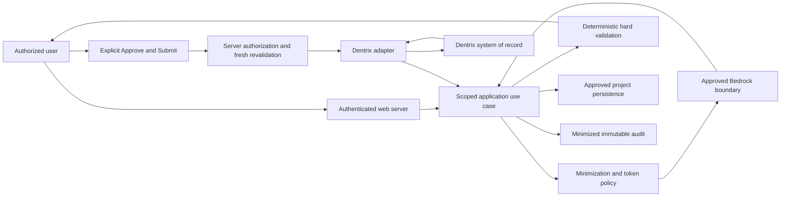

# Proposed PHI and scheduling data flow

Status: **PROPOSED; not an implemented or approved PHI flow.** No patient data is used by this scaffold. See [execution baseline](../project/execution-baseline.md).

No arrow grants authorization. Write enablement, verified concurrency/recovery design, and written IZURE production-write approval apply separately. The Bedrock path has no direct write connection.

| Data class | Intended boundary | Storage/logging decision still required |
| --- | --- | --- |
| Clinical and final appointment records | Dentrix is authoritative; minimum scoped reads for authorized tasks | No permanent parallel clinical database; any transient use needs reviewed retention |
| Random patient token and mapping | Restricted server policy; encrypted mapping storage; mapping excluded from AI | Token scope, expiration, re-identification permissions, deletion, backups |
| Patient free text / derived scheduling context | Validate and minimize before any AI call | Classify residual sensitivity; define redaction/allowlist, runtime memory/trace handling |
| Rules, duration configuration, versions | Project-owned scoped persistence | Approved schema, change audit, access and retention |
| User/session/tenant membership | Identity and authorization boundary | Identity provider, session enforcement, membership lifecycle |
| Booking recovery state | Minimum durable evidence required to reconcile ambiguous writes | Exact fields, encryption, tenant scope, TTL, disposal and operator access |
| Audit evidence | Attributable minimized events in protected storage | Agreement retention ≥6 years, immutable/no admin deletion; fields/access/mechanism pending |
| Operational and AI usage metadata | Sanitized monitoring with tenant-aware access where needed | Never raw payloads/prompts/credentials; review linkable references and retention |

Audit retention and temporary patient/booking retention are separate decisions. The six-year audit requirement must not silently become a six-year retention policy for patient mappings, prompts, or recovery payloads. Conversely, temporary TTL must not erase required minimized audit evidence.

Before PHI work, review threats across browser output, URLs, caches, HTTP errors, model input/output, token mappings, database backups, queues, audit records, telemetry, CI artifacts, screenshots and support tooling. Confirm client AWS account/region, applicable BAA/service eligibility and security configuration. Repository privacy scans help detect mistakes but cannot certify de-identification or compliance.
